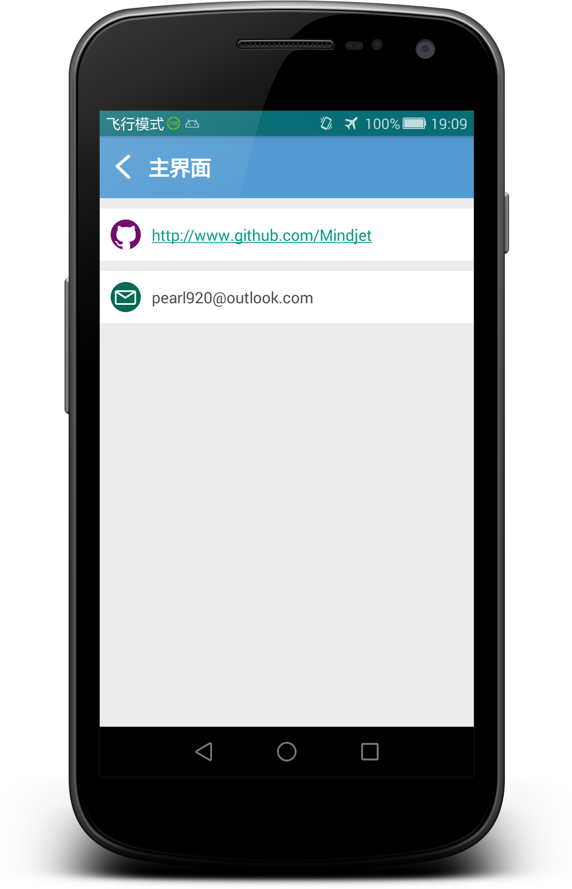

# NumberTool
This project implements a tool to get the information of your cellphone number.

###  Introduction

By offering cellphone numbers, users can get the information of their number, which includes Province, City, Areacode, Zip, Company and Card-type.

For example, if you search 18888888888, you can get information like this:
* Province: Beijing
* City: Beijing
* Areacode: 010
* Zip: 100000
* Company: China Mobile
* Card-type: China Mobile GSM/3G

Besides, this app allows users to get information of number offline using local storage.

### Structure

1. ListView: display search-history.
2. DialogFragment: display information of number.
3. Sqlite: store search-history.

### Screenshots

*Home*
 

*SlideMenu*
 

*Detail*
 

*Version*
 

*About*
 

### More

This application is now on its 2.0 version.
 
Welcome to download it on  http://app.mi.com/.

